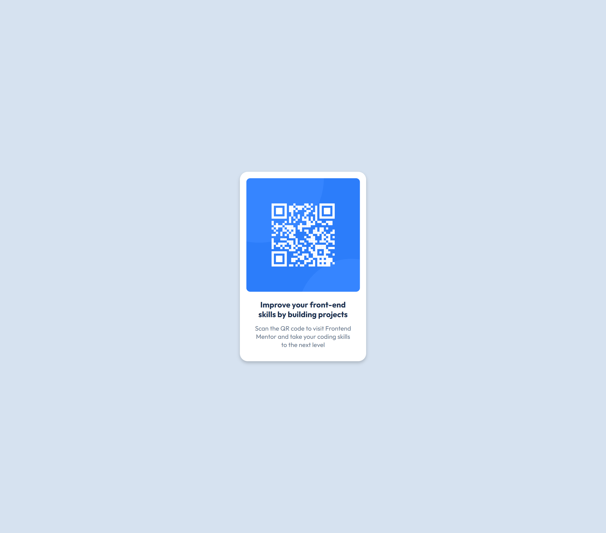
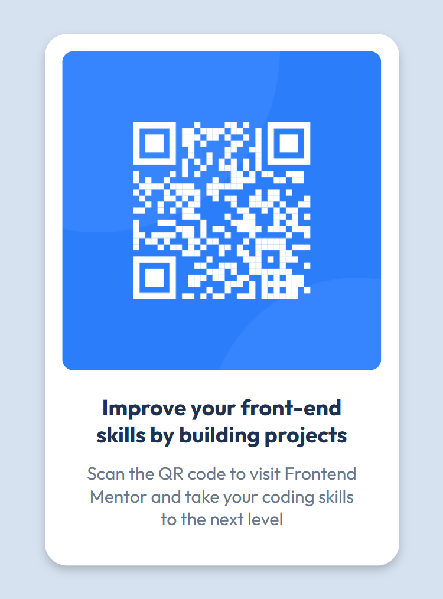

# Frontend Mentor - QR code component solution

This is a solution to the [QR code component challenge on Frontend Mentor](https://www.frontendmentor.io/challenges/qr-code-component-iux_sIO_H). Frontend Mentor challenges help you improve your coding skills by building realistic projects.

## Table of contents

- [Overview](#overview)
  - [Screenshot](#screenshot)
  - [Links](#links)
- [My process](#my-process)
  - [Built with](#built-with)
  - [What I learned](#what-i-learned)
  - [Continued development](#continued-development)
  - [Useful resources](#useful-resources)
- [Author](#author)
- [Acknowledgments](#acknowledgments)

## Overview

This project is a simple QR code component built as part of a Frontend Mentor challenge. The goal was to create a visually appealing and responsive card that displays a QR code, a heading, and a short description. The component is designed to look consistent across different devices and screen sizes, following the provided design specifications. It serves as a practical exercise in applying modern HTML and CSS techniques, focusing on layout, styling, and responsiveness.

### Screenshot




### Links

- Solution URL: [Add solution URL here](https://github.com/remainhumble/-QR-code-component)
- Live Site URL: [Add live site URL here](https://remainhumble.github.io/-QR-code-component/)

## My process

I began by carefully reviewing the project requirements and design files provided by Frontend Mentor. I set up the project structure using semantic HTML5 and organized my CSS with custom properties for easy theming. I implemented a mobile-first approach, starting with the layout for smaller screens and progressively enhancing it for larger devices using Flexbox. Throughout the process, I regularly tested the component in two different screen sizes to ensure responsiveness. I also made use of version control with Git to track my progress and manage changes efficiently.

### Built with

- Semantic HTML5 markup
- CSS custom properties
- Flexbox
- Mobile-first workflow

### What I learned

During this project, I deepened my understanding of responsive design and the importance of a mobile-first workflow. I learned how to use CSS custom properties to make theming and future changes easier. Implementing Flexbox allowed me to create a layout that adapts smoothly to different screen sizes.
I also practiced using Git for version control, which made it easier to track changes and experiment safely. Overall, this project reinforced the importance of planning, testing, and iterating on both design and code.

```html
<meta name="viewport" content="width=device-width, initial-scale=1.0" />
<!-- displays site properly based on user's device -->
```

```css
:root {
  --White: hsl(0, 0%, 100%);
  --Slate-300: hsl(212, 45%, 89%);
  --Slate-500: hsl(216, 15%, 48%);
  --Slate-900: hsl(218, 44%, 22%);
  <!-- These are the following colours from style-guide.md -->
}
```

### Continued development

In future projects, I want to continue improving my understanding of advanced CSS layout techniques, such as Grid and more complex Flexbox patterns. I also plan to focus on accessibility best practices to ensure my components are usable by everyone. Additionally, I aim to refine my skills in writing clean, maintainable code and explore using CSS preprocessors or utility frameworks. Practicing more with version control workflows and automated testing are also areas I want to develop further.

### Useful resources

- [MDN Web Docs - Responsive Design](https://developer.mozilla.org/en-US/docs/Learn/CSS/CSS_layout/Responsive_Design) - Comprehensive guide to responsive web design concepts and techniques.
- [CSS Tricks - A Complete Guide to Flexbox](https://css-tricks.com/snippets/css/a-guide-to-flexbox/) - Helped me understand and implement Flexbox layouts effectively.
- [Frontend Mentor Community](https://www.frontendmentor.io/community) - Great place to ask questions and see how others approach similar challenges.
- [Google Fonts](https://fonts.google.com/) - Used for selecting and implementing web fonts in the project.
- [GitHub Docs - Getting Started with Git](https://docs.github.com/en/get-started/quickstart) - Useful for managing version control throughout the project.

**Note: Delete this note and replace the list above with resources that helped you during the challenge. These could come in handy for anyone viewing your solution or for yourself when you look back on this project in the future.**

## Author

- Frontend Mentor - [@remainhumble](https://www.frontendmentor.io/profile/remainhumble)
- X(formerly Twitter) - [@thiflan120699](https://x.com/thiflan120699)
